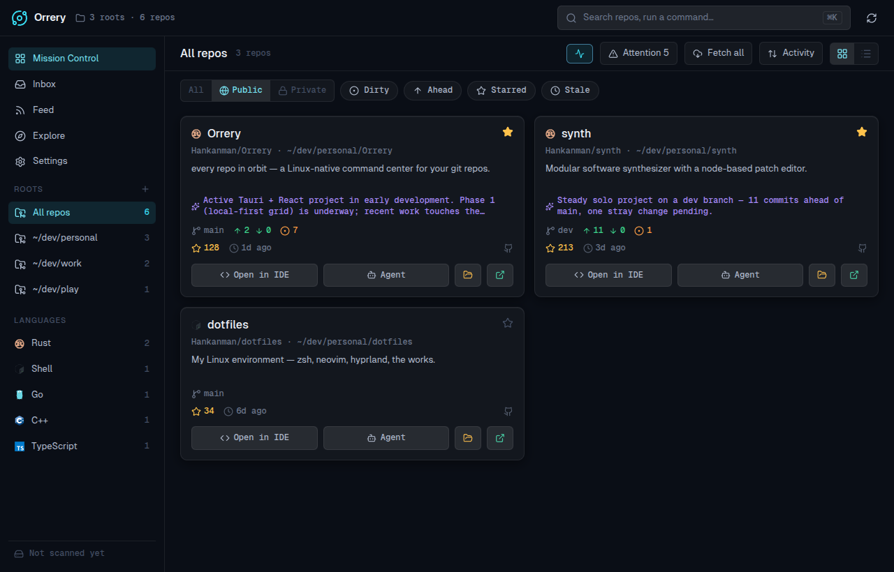

<div align="center">

# 🪐 Orrery

**every repo in orbit**

A Linux-native command center that puts every repo in your dev directories into orbit — live git status at a glance, one-click launch into your IDE or a terminal coding agent, enriched with multi-host data and local-AI summaries.

📖 **[Documentation & feature tour →](https://hankanman.github.io/Orrery/)**



</div>

---

> **Status:** 🚧 Early development, but functional. The core is built — Mission Control, multi-host enrichment, launchers, Inbox/Feed/Explore, and local AI all work. There's no packaged release yet, so it's [built from source](https://hankanman.github.io/Orrery/guide/getting-started). Expect rough edges; track progress in [the issues](../../issues).

## What is it?

Point Orrery at the directories where you keep your projects. It discovers every git repo inside them and lays them out in a dark, dense "mission control" grid. Each card fuses three sources of truth:

1. **Local git** — branch, ahead/behind, uncommitted changes, last commit, detected language
2. **Your git host** *(GitHub & GitLab, incl. self-hosted)* — stars, topics, releases, issues, visibility
3. **Local AI** — a synthesized "what is this / what's been happening" blurb, generated on-device

…and every card is a launchpad: one click to open the repo in your IDE, or to drop a terminal coding agent (Claude Code, Aider, Codex, …) straight into it.

## Features

- **Mission Control** — a virtualized grid that scales to hundreds of repos, with filters for visibility (public/private/all), dirty/ahead/starred/stale, workspace root, and language, plus an activity graph and a <kbd>⌘K</kbd> command palette.
- **One-click launchers** — open in your IDE or drop a terminal agent into any repo. Pick your tools from preset chips with real brand logos (VS Code, Cursor, Zed, the JetBrains family, …; Kitty/Alacritty/Ghostty/… × Claude Code/Aider/Codex/…). The card buttons show whatever you configured.
- **Repo drawer** — branches, recent commits, a staged-diff view with AI-generated commit messages and changelogs, and the README.
- **Inbox / Feed / Explore** — what needs you (PRs, reviews, issues, notifications), a release/social activity feed, and a browser for your starred repos with one-click clone.
- **Local AI** — repo summaries, commit messages, a daily briefing, and semantic search, all on-device via [Ollama](https://ollama.com). Turn it off and every AI affordance disappears.
- **Native desktop integration** — borrows the system theme, accent colour, and window decorations so it feels at home on KDE/GNOME.
- **Offline-first** — a local SQLite cache paints the grid instantly on launch and keeps working without a connection; visibility and host enrichment survive restarts.

See the [feature tour](https://hankanman.github.io/Orrery/guide/mission-control) for screenshots of each surface.

## Why?

There's no great *workspace dashboard* for Linux. GitKraken is heavy and git-focused; GitHub Desktop has no Linux build and is single-repo. Orrery is the at-a-glance morning view of everything you're working on — and the fastest way to jump back in.

## Stack

| Layer | Choice |
|---|---|
| Shell | [Tauri 2](https://tauri.app) — Rust core ↔ webview |
| Frontend | Vite + React + TypeScript + Tailwind + [shadcn/ui](https://ui.shadcn.com), [TanStack Router](https://tanstack.com/router) + Virtual |
| Git | `git2` (libgit2, vendored) |
| Persistence | SQLite (`rusqlite`, bundled) + TOML config (XDG dirs) |
| Hosts | GitHub + GitLab REST/GraphQL via `reqwest` (rustls), incl. self-hosted |
| Local AI | [Ollama](https://ollama.com) over HTTP — summaries, commit messages, embeddings |
| Desktop | `zbus` (D-Bus theme/accent), tray icon, global shortcut, notifications |

## Building

Prerequisites: a recent **Rust** toolchain, **Node + pnpm**, and the Tauri Linux
system libraries (`webkit2gtk-4.1`, `gtk3`, `libsoup-3.0`, `librsvg2`, plus a C
toolchain and `pkg-config`).

```bash
pnpm install          # install JS deps
pnpm tauri dev        # run the desktop app (Vite + Rust core)
pnpm tauri:build      # produce release bundles (deb + rpm + AppImage)
pnpm build            # frontend-only build (tsc + vite)
pnpm test             # Vitest suite
```

`tauri:build` runs `tauri build` with `NO_STRIP=true`. On modern distros (e.g.
Fedora) the linker emits a `.relr.dyn` section that the old `strip` bundled
inside `linuxdeploy` can't parse, which otherwise aborts the AppImage stage;
`NO_STRIP` skips that pass. Plain `pnpm tauri build` still works for deb/rpm.

Full setup details — distro-specific packages, first-run configuration, the web
demo build — are in the [Getting started guide](https://hankanman.github.io/Orrery/guide/getting-started).

## Documentation

The docs site is built with [VitePress](https://vitepress.dev) from the markdown
in [`docs/`](docs/) and deployed to GitHub Pages on every push that touches it:

```bash
pnpm docs:dev         # local docs dev server
pnpm docs:build       # build the static site
```

→ **https://hankanman.github.io/Orrery/**

## Linux display backend

On Linux the app configures two environment variables at startup (in
`run()`, before GTK/WebKit initialize). Both are only set if you haven't
already set them, so either can be overridden from the environment.

- **`WEBKIT_DISABLE_DMABUF_RENDERER=1`** — WebKitGTK's DMABUF renderer is
  broken on many drivers (notably NVIDIA), producing blank/garbled webviews
  or `Error 71 (Protocol error) dispatching to Wayland display`. It's
  disabled by default.
- **`GDK_BACKEND=x11` on KDE + Wayland only** — KWin only draws its
  server-side window decoration for X11/XWayland windows; GTK refuses
  server-side decorations on native Wayland, so a Wayland window gets a
  foreign-looking client-side titlebar instead of the system decoration.
  Forcing XWayland on KDE Wayland lets KWin draw the native titlebar.
  GNOME, wlroots, and X11 sessions are left untouched (CSD is the expected
  convention there).

This is decided at **runtime**, so a single build behaves correctly across
distros, desktops, and package formats — no per-package flags needed.

**Overrides:** run with `GDK_BACKEND=wayland orrery` to force native Wayland
(client-side decorations) on KDE, or `WEBKIT_DISABLE_DMABUF_RENDERER=0` to
re-enable the DMABUF renderer.

### Rendering smoothness on NVIDIA

WebKitGTK GPU-accelerates far less than Chromium, so the webview can feel
juddery where a browser is smooth — worst on NVIDIA, where we disable the
DMABUF renderer (above) and thereby give up accelerated compositing. The app
keeps WebKitGTK's accelerated compositor pinned on
(`hardware-acceleration-policy: ALWAYS`) and the UI is deliberately flat (no
backdrop blur, fixed backgrounds, or large shadow repaints) to stay smooth on
the CPU-bound path. `ORRERY_WEBKIT_ACCEL=1` keeps the DMABUF renderer enabled
for setups where it works (NVIDIA open kernel module + recent WebKitGTK).

The full investigation — every acceleration path we tried, what failed and why,
what ships, and a re-test matrix for when WebKitGTK/NVIDIA update — is in
[docs/rendering-performance.md](docs/rendering-performance.md).

## Roadmap

The four original phases are substantially in place:

- ✅ **Local-first grid** — scan → git metadata → grid → IDE/agent launchers.
- ✅ **Multi-host sync** — GitHub + GitLab (incl. self-hosted), stars/topics/releases/issues/visibility on cards, cached locally.
- ✅ **Local AI** — on-device summaries, commit messages, daily briefing, semantic search via Ollama.
- ✅ **Starred / followed browser** — Explore (starred + clone) and Feed (releases/activity).

Next up and ongoing work lives in [the issue list](../../issues).

## License

Released under the [MIT License](LICENSE).
